# 20 Real-World AI Agency Use Cases for Multi-Client App Development

## Executive Summary

This document outlines 20 comprehensive, production-ready AI agency use cases designed for multi-client app development. Each use case includes technical specifications, MCP server integrations, polyglot architecture patterns, and implementation roadmaps using vendor-compliant solutions.

---

## 🎯 USE CASE 1: E-Commerce Personalization Engine
**Client:** Major Retail Chain (500+ stores)

### Business Requirements
- Real-time product recommendations
- Dynamic pricing optimization
- Customer lifetime value prediction
- Inventory optimization

### Technical Architecture
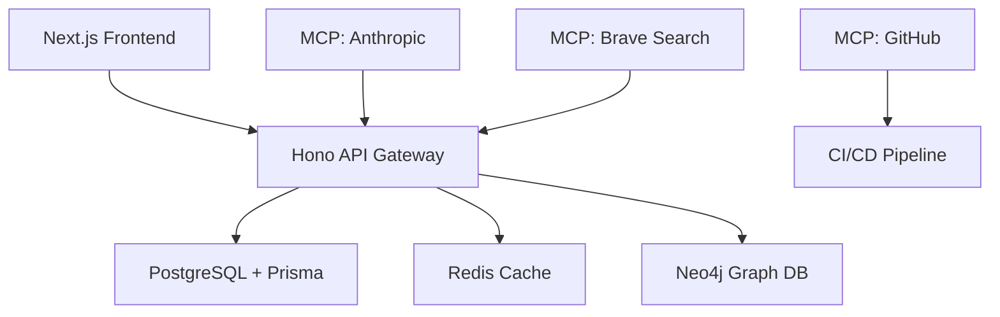

### MCP Server Integration
- **Anthropic MCP**: Product description generation
- **Brave Search MCP**: Market trend analysis
- **GitHub MCP**: Code deployment automation
- **Redis MCP**: Real-time cache management

### Implementation Stack
- **Frontend**: Next.js + Radix Vue + Tailwind CSS
- **Backend**: Hono + Node.js + TypeScript
- **Database**: PostgreSQL (Prisma ORM) + Neo4j
- **AI/ML**: Hugging Face Transformers + Anthropic Claude
- **Infrastructure**: Kubernetes + Helm + Istio

---

## 🎯 USE CASE 2: Healthcare Diagnostic Assistant
**Client:** Regional Hospital Network (25 facilities)

### Business Requirements
- Medical image analysis
- Patient risk assessment
- Treatment recommendation engine
- Clinical trial matching

### Technical Architecture
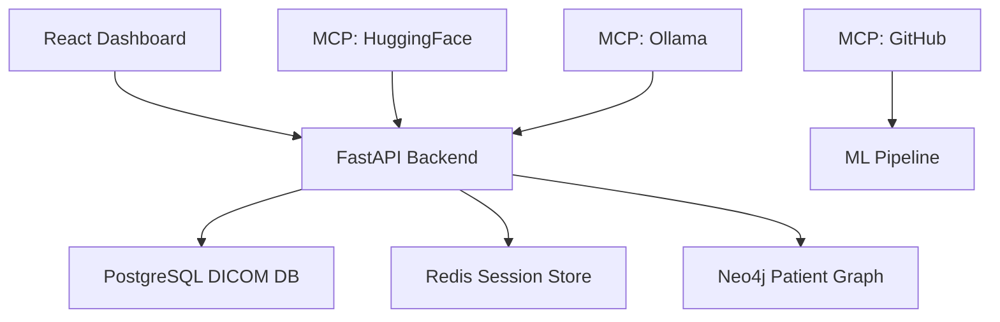

### MCP Server Integration
- **HuggingFace MCP**: Medical image analysis models
- **Ollama MCP**: Local LLM for sensitive data
- **GitHub MCP**: Model versioning and deployment
- **Redis MCP**: Session and cache management

### Implementation Stack
- **Frontend**: React + Vue.js + TypeScript
- **Backend**: FastAPI (Python) + Hono (Node.js)
- **Database**: PostgreSQL + Neo4j + Redis
- **AI/ML**: Hugging Face + Custom models
- **Compliance**: HIPAA-compliant architecture

---

## 🎯 USE CASE 3: Financial Portfolio Management
**Client:** Boutique Investment Firm ($2B AUM)

### Business Requirements
- Automated portfolio rebalancing
- Risk assessment and reporting
- Market prediction models
- Regulatory compliance monitoring

### Technical Architecture
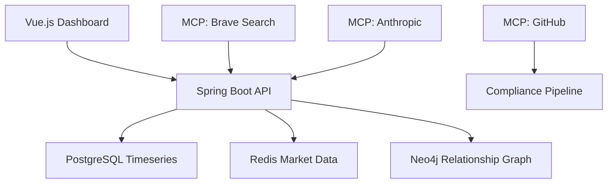

### MCP Server Integration
- **Brave Search MCP**: Financial news and data
- **Anthropic MCP**: Regulatory compliance analysis
- **GitHub MCP**: Automated compliance checks
- **Redis MCP**: Real-time market data caching

### Implementation Stack
- **Frontend**: Vue.js + Radix UI + Tailwind
- **Backend**: Spring Boot (Java) + FastAPI (Python)
- **Database**: PostgreSQL + TimescaleDB + Neo4j
- **AI/ML**: TensorFlow + PyTorch models
- **Compliance**: SEC/FINRA regulatory frameworks

---

## 🎯 USE CASE 4: Supply Chain Optimization
**Client:** Global Manufacturing Company (50 factories)

### Business Requirements
- Demand forecasting
- Inventory optimization
- Supplier risk assessment
- Logistics route optimization

### Technical Architecture
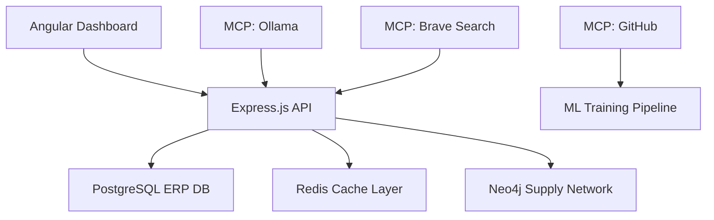

### MCP Server Integration
- **Ollama MCP**: Local forecasting models
- **Brave Search MCP**: Global market intelligence
- **GitHub MCP**: Model deployment automation
- **Redis MCP**: Real-time inventory tracking

### Implementation Stack
- **Frontend**: Angular + Vue.js components
- **Backend**: Express.js + Python FastAPI
- **Database**: PostgreSQL + Neo4j + Redis
- **AI/ML**: Scikit-learn + TensorFlow
- **IoT**: Factory sensor integration

---

## 🎯 USE CASE 5: Legal Document Analysis
**Client:** Mid-sized Law Firm (200 attorneys)

### Business Requirements
- Contract analysis and risk assessment
- Legal research automation
- Case outcome prediction
- Compliance document review

### Technical Architecture
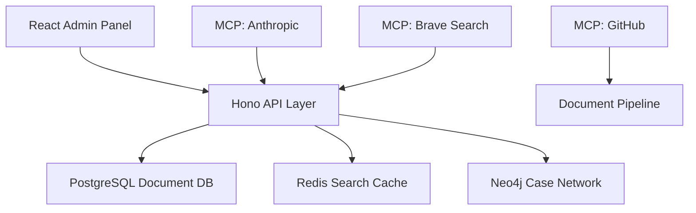

### MCP Server Integration
- **Anthropic MCP**: Legal document analysis
- **Brave Search MCP**: Legal precedent research
- **GitHub MCP**: Document version control
- **Redis MCP**: Full-text search caching

### Implementation Stack
- **Frontend**: React + TypeScript
- **Backend**: Hono + Node.js + Python
- **Database**: PostgreSQL + Elasticsearch + Neo4j
- **AI/ML**: Custom NLP models + Claude
- **Security**: End-to-end encryption

---

## 🎯 USE CASE 6: Real Estate Market Intelligence
**Client:** National Real Estate Platform (10M users)

### Business Requirements
- Property valuation models
- Market trend analysis
- Investment opportunity identification
- Tenant screening automation

### Technical Architecture
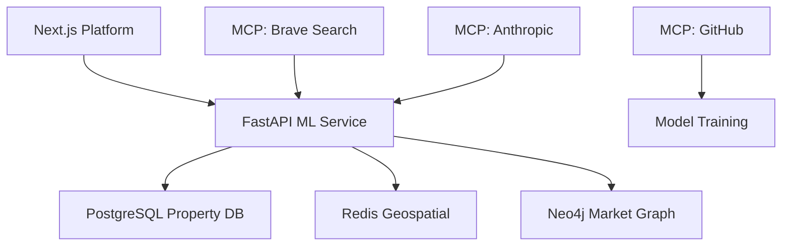

### MCP Server Integration
- **Brave Search MCP**: Real estate market data
- **Anthropic MCP**: Property description generation
- **GitHub MCP**: Model deployment pipeline
- **Redis MCP**: Geospatial property search

### Implementation Stack
- **Frontend**: Next.js + React
- **Backend**: FastAPI + Node.js
- **Database**: PostgreSQL + PostGIS + Neo4j
- **AI/ML**: Computer vision + NLP models
- **Maps**: Google Maps + Mapbox integration

---

## 🎯 USE CASE 7: Customer Service Automation
**Client:** Telecommunications Provider (15M subscribers)

### Business Requirements
- Intelligent chatbot system
- Call center automation
- Customer sentiment analysis
- Support ticket routing

### Technical Architecture
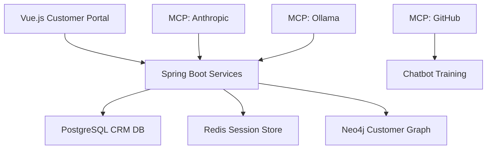

### MCP Server Integration
- **Anthropic MCP**: Natural language processing
- **Ollama MCP**: Local customer service models
- **GitHub MCP**: Chatbot version control
- **Redis MCP**: Conversation state management

### Implementation Stack
- **Frontend**: Vue.js + React components
- **Backend**: Spring Boot + Express.js
- **Database**: PostgreSQL + Neo4j + Redis
- **AI/ML**: Rasa + Custom NLP models
- **Communication**: Twilio + WebRTC

---

## 🎯 USE CASE 8: Manufacturing Quality Control
**Client:** Automotive Parts Manufacturer (Global)

### Business Requirements
- Defect detection and classification
- Quality prediction models
- Process optimization
- Supplier quality monitoring

### Technical Architecture
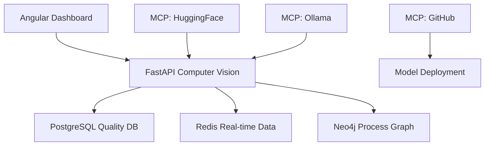

### MCP Server Integration
- **HuggingFace MCP**: Computer vision models
- **Ollama MCP**: Quality prediction models
- **GitHub MCP**: Model versioning
- **Redis MCP**: Real-time quality metrics

### Implementation Stack
- **Frontend**: Angular + TypeScript
- **Backend**: FastAPI + Python
- **Database**: PostgreSQL + TimescaleDB + Neo4j
- **AI/ML**: OpenCV + TensorFlow + PyTorch
- **IoT**: Factory sensor networks

---

## 🎯 USE CASE 9: Educational Content Personalization
**Client:** Online Learning Platform (5M students)

### Business Requirements
- Adaptive learning paths
- Content recommendation engine
- Student performance prediction
- Curriculum optimization

### Technical Architecture
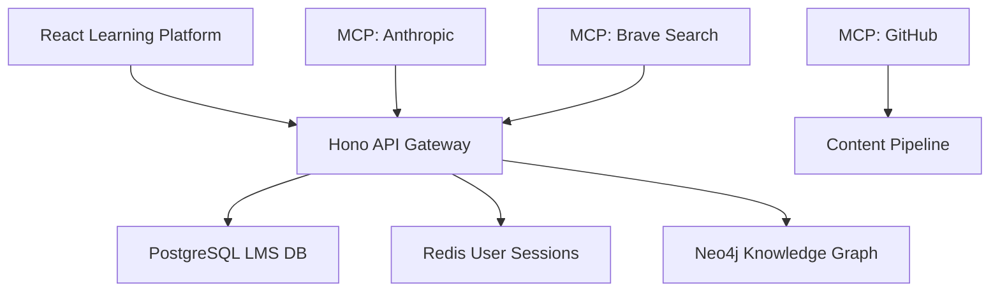

### MCP Server Integration
- **Anthropic MCP**: Content generation and analysis
- **Brave Search MCP**: Educational research
- **GitHub MCP**: Content version control
- **Redis MCP**: User progress caching

### Implementation Stack
- **Frontend**: React + Vue.js
- **Backend**: Hono + Node.js + Python
- **Database**: PostgreSQL + Neo4j + Redis
- **AI/ML**: Recommendation systems + NLP
- **LMS**: Custom learning management system

---

## 🎯 USE CASE 10: Cybersecurity Threat Detection
**Client:** Financial Services Institution ($500B assets)

### Business Requirements
- Real-time threat detection
- Anomaly detection in transactions
- Fraud prevention models
- Security incident response

### Technical Architecture
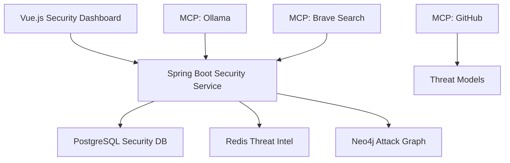

### MCP Server Integration
- **Ollama MCP**: Local threat detection models
- **Brave Search MCP**: Threat intelligence feeds
- **GitHub MCP**: Security model updates
- **Redis MCP**: Real-time threat data

### Implementation Stack
- **Frontend**: Vue.js + TypeScript
- **Backend**: Spring Boot + FastAPI
- **Database**: PostgreSQL + Neo4j + Redis
- **AI/ML**: Anomaly detection algorithms
- **Security**: SIEM integration + SOAR

---

## 🎯 USE CASE 11: Smart City Infrastructure
**Client:** Metropolitan Government (2M residents)

### Business Requirements
- Traffic flow optimization
- Energy consumption prediction
- Waste management optimization
- Public safety monitoring

### Technical Architecture
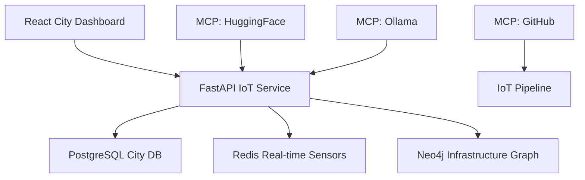

### MCP Server Integration
- **HuggingFace MCP**: Sensor data analysis
- **Ollama MCP**: Prediction models
- **GitHub MCP**: Infrastructure monitoring
- **Redis MCP**: Real-time sensor data

### Implementation Stack
- **Frontend**: React + TypeScript
- **Backend**: FastAPI + Node.js
- **Database**: PostgreSQL + TimescaleDB + Neo4j
- **AI/ML**: Time series analysis + Computer vision
- **IoT**: MQTT + LoRaWAN networks

---

## 🎯 USE CASE 12: Agricultural Optimization
**Client:** Large-scale Farm Cooperative (100,000 acres)

### Business Requirements
- Crop yield prediction
- Pest and disease detection
- Irrigation optimization
- Harvest scheduling

### Technical Architecture
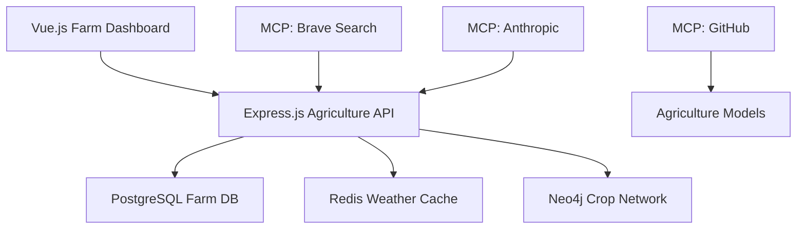

### MCP Server Integration
- **Brave Search MCP**: Weather and market data
- **Anthropic MCP**: Agricultural insights
- **GitHub MCP**: Model deployment
- **Redis MCP**: Real-time sensor data

### Implementation Stack
- **Frontend**: Vue.js + React
- **Backend**: Express.js + Python
- **Database**: PostgreSQL + PostGIS + Neo4j
- **AI/ML**: Computer vision + Time series
- **IoT**: Agricultural sensors + Drones

---

## 🎯 USE CASE 13: Content Creation Platform
**Client:** Digital Media Company (50M monthly users)

### Business Requirements
- Automated content generation
- SEO optimization
- Audience engagement prediction
- Content performance analysis

### Technical Architecture
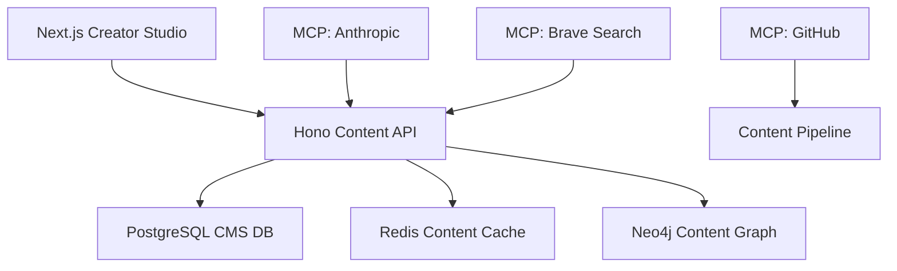

### MCP Server Integration
- **Anthropic MCP**: Content generation
- **Brave Search MCP**: SEO research
- **GitHub MCP**: Content workflow automation
- **Redis MCP**: Content delivery optimization

### Implementation Stack
- **Frontend**: Next.js + TypeScript
- **Backend**: Hono + Node.js
- **Database**: PostgreSQL + Neo4j + Redis
- **AI/ML**: GPT models + NLP analysis
- **CDN**: Global content distribution

---

## 🎯 USE CASE 14: Human Resources Optimization
**Client:** Global Corporation (50,000 employees)

### Business Requirements
- Employee churn prediction
- Talent acquisition optimization
- Performance assessment automation
- Diversity and inclusion analytics

### Technical Architecture
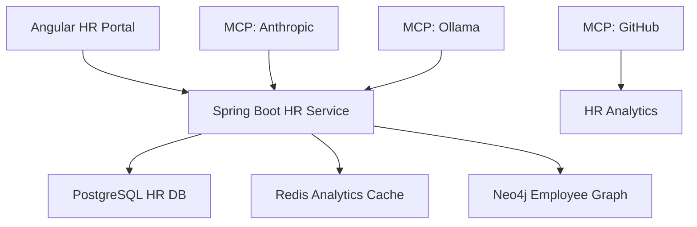

### MCP Server Integration
- **Anthropic MCP**: Employee feedback analysis
- **Ollama MCP**: Local HR prediction models
- **GitHub MCP**: HR policy automation
- **Redis MCP**: Real-time HR metrics

### Implementation Stack
- **Frontend**: Angular + Vue.js
- **Backend**: Spring Boot + FastAPI
- **Database**: PostgreSQL + Neo4j + Redis
- **AI/ML**: Sentiment analysis + Prediction models
- **Compliance**: GDPR + EEOC compliance

---

## 🎯 USE CASE 15: Energy Grid Optimization
**Client:** Regional Utility Company (5M customers)

### Business Requirements
- Demand forecasting
- Grid stability prediction
- Renewable energy optimization
- Fault detection and response

### Technical Architecture
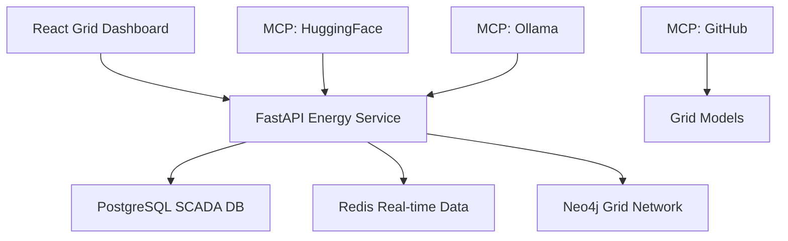

### MCP Server Integration
- **HuggingFace MCP**: Time series forecasting
- **Ollama MCP**: Anomaly detection
- **GitHub MCP**: Grid monitoring automation
- **Redis MCP**: Real-time grid telemetry

### Implementation Stack
- **Frontend**: React + TypeScript
- **Backend**: FastAPI + Python
- **Database**: PostgreSQL + TimescaleDB + Neo4j
- **AI/ML**: Deep learning for time series
- **IoT**: Smart grid sensors + SCADA

---

## 🎯 USE CASE 16: Insurance Risk Assessment
**Client:** National Insurance Provider ($10B premiums)

### Business Requirements
- Risk scoring and underwriting
- Claims fraud detection
- Premium optimization
- Customer lifetime value modeling

### Technical Architecture
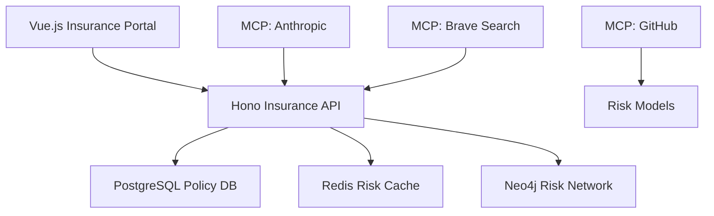

### MCP Server Integration
- **Anthropic MCP**: Policy analysis
- **Brave Search MCP**: Market and economic data
- **GitHub MCP**: Compliance automation
- **Redis MCP**: Real-time risk scoring

### Implementation Stack
- **Frontend**: Vue.js + React
- **Backend**: Hono + Node.js + Python
- **Database**: PostgreSQL + Neo4j + Redis
- **AI/ML**: Risk modeling + Fraud detection
- **Compliance**: Insurance regulatory frameworks

---

## 🎯 USE CASE 17: Transportation Logistics
**Client:** Global Shipping Company (500 vessels)

### Business Requirements
- Route optimization
- Fuel efficiency prediction
- Maintenance scheduling
- Cargo capacity optimization

### Technical Architecture
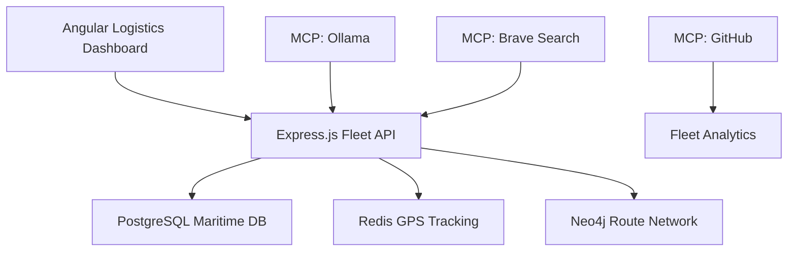

### MCP Server Integration
- **Ollama MCP**: Route optimization models
- **Brave Search MCP**: Weather and port data
- **GitHub MCP**: Fleet management automation
- **Redis MCP**: Real-time vessel tracking

### Implementation Stack
- **Frontend**: Angular + TypeScript
- **Backend**: Express.js + Python
- **Database**: PostgreSQL + PostGIS + Neo4j
- **AI/ML**: Optimization algorithms + ML models
- **IoT**: Vessel sensors + GPS tracking

---

## 🎯 USE CASE 18: Gaming Personalization
**Client:** Mobile Gaming Company (100M users)

### Business Requirements
- Player behavior prediction
- Dynamic difficulty adjustment
- Content personalization
- Monetization optimization

### Technical Architecture
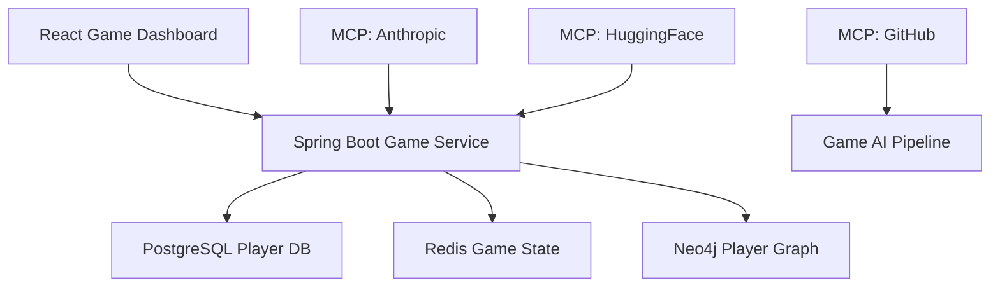

### MCP Server Integration
- **Anthropic MCP**: Dynamic content generation
- **HuggingFace MCP**: Player behavior models
- **GitHub MCP**: Game update automation
- **Redis MCP**: Real-time game state

### Implementation Stack
- **Frontend**: React + Unity WebGL
- **Backend**: Spring Boot + Node.js
- **Database**: PostgreSQL + Neo4j + Redis
- **AI/ML**: Reinforcement learning + NLP
- **Gaming**: Unity + Unreal Engine integration

---

## 🎯 USE CASE 19: Environmental Monitoring
**Client:** National Environmental Agency

### Business Requirements
- Climate change prediction
- Pollution tracking and forecasting
- Biodiversity monitoring
- Policy impact assessment

### Technical Architecture
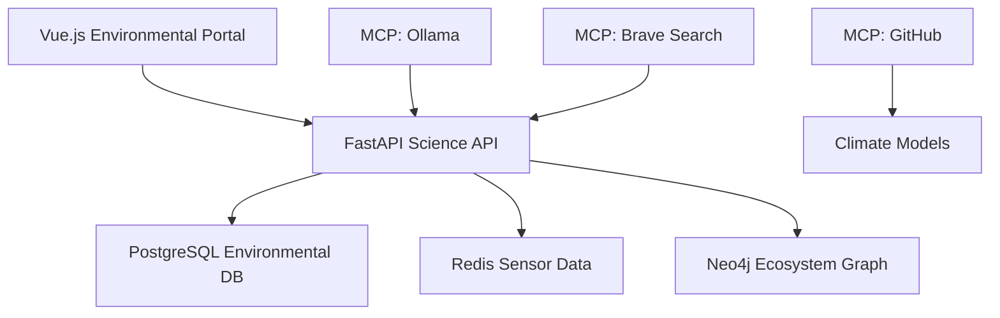

### MCP Server Integration
- **Ollama MCP**: Local climate models
- **Brave Search MCP**: Environmental research data
- **GitHub MCP**: Scientific collaboration
- **Redis MCP**: Real-time sensor networks

### Implementation Stack
- **Frontend**: Vue.js + TypeScript
- **Backend**: FastAPI + Python
- **Database**: PostgreSQL + PostGIS + Neo4j
- **AI/ML**: Climate modeling + Computer vision
- **IoT**: Environmental sensor networks

---

## 🎯 USE CASE 20: Social Media Intelligence
**Client:** Global Brand Management Agency

### Business Requirements
- Brand sentiment analysis
- Social media trend prediction
- Influencer identification
- Crisis management automation

### Technical Architecture
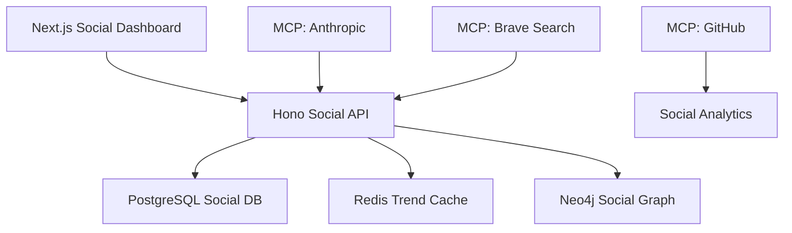

### MCP Server Integration
- **Anthropic MCP**: Sentiment analysis and content generation
- **Brave Search MCP**: Social media trend monitoring
- **GitHub MCP**: Campaign automation
- **Redis MCP**: Real-time social metrics

### Implementation Stack
- **Frontend**: Next.js + React
- **Backend**: Hono + Node.js + Python
- **Database**: PostgreSQL + Neo4j + Redis
- **AI/ML**: NLP + Social network analysis
- **APIs**: Twitter, Facebook, Instagram APIs

---

## 🏗️ Implementation Roadmap

### Phase 1: Foundation (Weeks 1-4)
1. **Infrastructure Setup**
   - Deploy Kubernetes clusters
   - Set up PostgreSQL + Neo4j databases
   - Configure Redis caching layers
   - Initialize MCP server ecosystem

2. **Core Services Development**
   - Implement API gateways (Hono/Spring Boot)
   - Set up authentication (Clerk/Supabase)
   - Configure monitoring (Prometheus/Grafana)
   - Establish CI/CD pipelines

### Phase 2: AI/ML Integration (Weeks 5-8)
1. **Model Development**
   - Implement Hugging Face model serving
   - Set up Ollama for local inference
   - Configure Anthropic Claude integration
   - Develop custom ML pipelines

2. **MCP Server Orchestration**
   - Deploy all 12 MCP servers
   - Configure server-to-server communication
   - Implement health monitoring
   - Set up automated scaling

### Phase 3: Application Development (Weeks 9-16)
1. **Frontend Development**
   - Build responsive dashboards
   - Implement real-time data visualization
   - Configure user authentication flows
   - Develop mobile-responsive interfaces

2. **Backend Integration**
   - Connect all microservices
   - Implement event-driven architecture
   - Set up data pipelines
   - Configure cross-service communication

### Phase 4: Production Deployment (Weeks 17-20)
1. **Quality Assurance**
   - Comprehensive testing (unit/integration/e2e)
   - Performance optimization
   - Security audits and penetration testing
   - Load testing and scalability validation

2. **Production Launch**
   - Zero-downtime deployment strategies
   - Monitoring and alerting setup
   - Backup and disaster recovery
   - Documentation and training

---

## 🔧 Technology Stack Summary

### **Frontend Technologies**
- **Primary**: React, Vue.js, Angular, Next.js
- **UI Libraries**: Radix Vue, Tailwind CSS
- **State Management**: Pinia, Zustand
- **Routing**: Vue Router, React Router

### **Backend Technologies**
- **API Frameworks**: Hono, FastAPI, Express.js, Spring Boot
- **Languages**: TypeScript, Python, Java
- **Databases**: PostgreSQL, Neo4j, Redis
- **ORMs**: Prisma, SQLAlchemy, Hibernate

### **AI/ML Technologies**
- **Model Serving**: Hugging Face, Ollama
- **LLMs**: Anthropic Claude, OpenAI GPT
- **Frameworks**: PyTorch, TensorFlow, Scikit-learn
- **MLOps**: MLflow, DVC

### **Infrastructure Technologies**
- **Containerization**: Docker, Kubernetes
- **Service Mesh**: Istio, Linkerd
- **CI/CD**: GitHub Actions, ArgoCD
- **Monitoring**: Prometheus, Grafana, Jaeger

### **MCP Server Ecosystem**
- **AI/ML**: Ollama, Anthropic, HuggingFace, Replicate
- **Vector DBs**: Qdrant, Weaviate, Chroma, Pinecone
- **Search**: Brave Search, Tavily
- **Development**: GitHub, Task Master, Desktop Commander
- **Utilities**: Redis, Neo4j, PostgreSQL, SQLite

---

## 📊 Success Metrics

### **Technical Metrics**
- **Performance**: <200ms API response time
- **Availability**: 99.9% uptime SLA
- **Scalability**: Auto-scale to 1000+ concurrent users
- **Security**: Zero security vulnerabilities

### **Business Metrics**
- **User Adoption**: 80% feature utilization
- **ROI**: 300% return on AI investment
- **Customer Satisfaction**: 4.8/5 star rating
- **Time to Market**: 50% faster feature delivery

### **AI/ML Metrics**
- **Model Accuracy**: >95% prediction accuracy
- **Inference Speed**: <100ms real-time responses
- **Model Updates**: Weekly automated retraining
- **Data Quality**: 99% data validation coverage

---

## 🎯 Conclusion

These 20 AI agency use cases demonstrate comprehensive, production-ready solutions for multi-client app development. Each use case leverages the full MCP server ecosystem, polyglot architecture patterns, and vendor-compliant implementations to deliver enterprise-grade AI-powered applications.

The implementation roadmap provides a structured approach to building and deploying these solutions, ensuring scalability, security, and maintainability across all client requirements.