# 🏗️ AI Agency Platform - Target Architecture



```mermaid
graph TB
    subgraph "Client Layer"
        A1[Web Applications]
        A2[Mobile Apps]
        A3[CLI Tools]
    end

    subgraph "API Gateway Layer"
        B1[Kong API Gateway]
        B2[Apollo GraphQL Gateway]
        B3[Traefik Reverse Proxy]
    end

    subgraph "Microservices Layer"
        C1[Users Service]
        C2[Analytics Service]
        C3[AI/ML Service]
        C4[E-commerce Service]
        C5[Campaigns Service]
    end

    subgraph "Event Streaming"
        D1[Kafka Event Bus]
        D2[Confluent Schema Registry]
        D3[Kafka Connect]
    end

    subgraph "Workflow Orchestration"
        E1[Temporal Server]
        E2[Activity Workers]
        E3[Workflow Definitions]
    end

    subgraph "Data Layer"
        F1[(PostgreSQL - Primary)]
        F2[(Neo4j - Graph)]
        F3[(Redis - Cache)]
        F4[(Qdrant - Vectors)]
        F5[(Elasticsearch - Search)]
    end

    subgraph "AI/ML Infrastructure"
        G1[Ollama Models]
        G2[Hugging Face Hub]
        G3[MLflow Tracking]
        G4[Optuna Optimization]
    end

    subgraph "MCP Ecosystem"
        H1[exa-mcp - Research]
        H2[brave-mcp - Web Search]
        H3[tavily-mcp - AI Search]
        H4[github-mcp - Code Analysis]
        H5[filesystem-mcp - File Ops]
        H6[sequential-thinking-mcp - Planning]
    end

    subgraph "Vendor CLI Tools"
        I1[gh - GitHub CLI]
        I2[pixi - Package Manager]
        I3[mise - Version Manager]
        I4[docker - Container Runtime]
        I5[kubectl - Kubernetes]
        I6[helm - Package Manager]
    end

    subgraph "Monitoring & Observability"
        J1[Prometheus Metrics]
        J2[Grafana Dashboards]
        J3[Jaeger Tracing]
        J4[Loki Logging]
        J5[Promtail Collectors]
    end

    subgraph "Development Tools"
        K1[Turborepo - Build System]
        K2[Vitest - Testing]
        K3[ESLint/Prettier - Code Quality]
        K4[Prisma - ORM]
        K5[Zod - Validation]
        K6[Pino - Logging]
    end

    subgraph "Security & Secrets"
        L1[1Password - Secrets Management]
        L2[Clerk - Authentication]
        L3[CORS Policies]
        L4[Rate Limiting]
        L5[JWT Tokens]
    end

    %% Connections
    A1 --> B1
    A2 --> B2
    A3 --> B3

    B1 --> C1
    B1 --> C2
    B1 --> C3
    B2 --> C4
    B2 --> C5

    C1 --> D1
    C2 --> D1
    C3 --> D1
    C4 --> D1
    C5 --> D1

    D1 --> E1
    E1 --> E2
    E2 --> E3

    C1 --> F1
    C2 --> F2
    C3 --> F3
    C4 --> F4
    C5 --> F5

    C3 --> G1
    C3 --> G2
    G3 --> G4

    H1 --> C3
    H2 --> C3
    H3 --> C3
    H4 --> C3
    H5 --> C3
    H6 --> C3

    I1 --> C1
    I2 --> C2
    I3 --> C3
    I4 --> C4
    I5 --> C5

    C1 --> J1
    C2 --> J2
    C3 --> J3
    C4 --> J4
    C5 --> J5

    K1 --> C1
    K2 --> C2
    K3 --> C3
    K4 --> C4
    K5 --> C5

    L1 --> C1
    L2 --> C2
    L3 --> C3
    L4 --> C4
    L5 --> C5

    %% Styling
    classDef client fill:#e1f5fe
    classDef gateway fill:#f3e5f5
    classDef services fill:#e8f5e8
    classDef events fill:#fff3e0
    classDef workflow fill:#fce4ec
    classDef data fill:#f1f8e9
    classDef ai fill:#e0f2f1
    classDef mcp fill:#f9fbe7
    classDef cli fill:#efebe9
    classDef monitoring fill:#e3f2fd
    classDef dev fill:#f8bbd9
    classDef security fill:#d1c4e9

    class A1,A2,A3 client
    class B1,B2,B3 gateway
    class C1,C2,C3,C4,C5 services
    class D1,D2,D3 events
    class E1,E2,E3 workflow
    class F1,F2,F3,F4,F5 data
    class G1,G2,G3,G4 ai
    class H1,H2,H3,H4,H5,H6 mcp
    class I1,I2,I3,I4,I5,I6 cli
    class J1,J2,J3,J4,J5 monitoring
    class K1,K2,K3,K4,K5,K6 dev
    class L1,L2,L3,L4,L5 security
```

## Architecture Overview

### 🎯 Core Principles
- **Zero Custom Code**: All implementations use vendor solutions only
- **Microservices Architecture**: Independent, scalable services
- **Event-Driven Communication**: Kafka for async operations
- **CQRS Pattern**: Separate read/write models
- **Vendor Compliance**: 50+ CLI tools, MCP servers, official SDKs

### 🔧 Technology Stack

#### Frontend Layer
- **React/Next.js**: Component libraries only (no custom components)
- **Tailwind CSS**: Utility-first styling
- **Radix UI**: Accessible component primitives
- **Zustand**: State management (no Redux)

#### API Gateway Layer
- **Kong**: API gateway with plugins
- **Apollo Gateway**: GraphQL federation
- **Traefik**: Reverse proxy and load balancing

#### Microservices Layer
- **Node.js/Hono**: API frameworks
- **Python/FastAPI**: ML services
- **Go**: High-performance services
- **Rust**: System services

#### Data Layer
- **PostgreSQL**: Primary relational database
- **Neo4j**: Graph database for relationships
- **Redis**: Caching and session management
- **Qdrant**: Vector database for embeddings
- **Elasticsearch**: Search and analytics

#### Event Streaming
- **Apache Kafka**: Event bus
- **Confluent Schema Registry**: Schema management
- **Kafka Connect**: Data integration

#### Workflow Orchestration
- **Temporal**: Durable workflow execution
- **Activity Workers**: Business logic execution
- **Workflow Definitions**: Declarative process modeling

#### AI/ML Infrastructure
- **Ollama**: Local LLM serving
- **Hugging Face**: Model hub and inference
- **MLflow**: Experiment tracking
- **Optuna**: Hyperparameter optimization

#### MCP Ecosystem
- **exa-mcp**: Web research and content extraction
- **brave-mcp**: Privacy-focused web search
- **tavily-mcp**: AI-powered search
- **github-mcp**: Code repository analysis
- **filesystem-mcp**: File system operations
- **sequential-thinking-mcp**: Structured problem solving

#### Development Tools
- **Turborepo**: Monorepo build system
- **Vitest**: Fast unit testing
- **ESLint/Prettier**: Code quality and formatting
- **Prisma**: Type-safe database access
- **Zod**: Runtime type validation
- **Pino**: Structured logging

#### CLI Tools (50+ installed)
- **gh**: GitHub CLI for repository management
- **pixi**: Python/Rust/Go package manager
- **mise**: Polyglot version manager
- **docker**: Container runtime
- **kubectl**: Kubernetes cluster management
- **helm**: Kubernetes package manager
- **k9s**: Kubernetes CLI dashboard
- **stern**: Multi-pod log tailing
- **fd**: Fast file finder
- **ripgrep**: Fast text search
- **bat**: Syntax-highlighted file viewer
- **exa**: Modern ls replacement
- **jq/yq**: JSON/YAML processors
- **miller**: CSV/data processing
- **hyperfine**: Benchmarking tool
- **wrk/hey/vegeta**: Load testing
- **ast-grep**: Structural code search
- **shellcheck**: Shell script analysis

#### Security & Compliance
- **1Password**: Secrets management
- **Clerk**: Authentication and user management
- **CORS**: Cross-origin resource sharing
- **Rate Limiting**: API protection
- **JWT**: Token-based authentication

#### Monitoring & Observability
- **Prometheus**: Metrics collection
- **Grafana**: Visualization dashboards
- **Jaeger**: Distributed tracing
- **Loki**: Log aggregation
- **Promtail**: Log shipping

## Data Flow Architecture

### 1. Client Request Flow
```
Client → Kong Gateway → Service Mesh → Microservice → Database
       ↓              ↓              ↓              ↓
   Authentication  Rate Limiting  Circuit Breaker  Connection Pool
```

### 2. Event-Driven Flow
```
User Action → Kafka Topic → Temporal Workflow → Activity Workers → Database Updates
              ↓                    ↓                      ↓
       Schema Validation    Durable Execution     Transaction Management
```

### 3. AI/ML Pipeline Flow
```
Data Input → Feature Engineering → Model Inference → Result Caching → API Response
             ↓                        ↓                      ↓
      Preprocessing            Ollama/HF Models         Redis Cache
```

### 4. Monitoring Flow
```
Application Metrics → Prometheus → Grafana Dashboards
Log Events → Promtail → Loki → Grafana Exploration
Traces → Jaeger → Distributed Tracing Analysis
```

## CRUD Operations Mapping

### User Management Service
```typescript
interface UserCRUD {
  // CREATE
  POST /users → CreateUserCommand → UserCreatedEvent

  // READ
  GET /users → UserQuery → UserDTO[]
  GET /users/:id → UserByIdQuery → UserDTO

  // UPDATE
  PUT /users/:id → UpdateUserCommand → UserUpdatedEvent

  // DELETE
  DELETE /users/:id → DeleteUserCommand → UserDeletedEvent
}
```

### Analytics Service
```typescript
interface AnalyticsCRUD {
  // CREATE
  POST /events → TrackEventCommand → EventTrackedEvent

  // READ
  GET /analytics/users → UserAnalyticsQuery → AnalyticsDTO
  GET /analytics/revenue → RevenueAnalyticsQuery → RevenueDTO

  // UPDATE
  PUT /analytics/config → UpdateAnalyticsConfigCommand → ConfigUpdatedEvent

  // DELETE
  DELETE /analytics/data → PurgeAnalyticsDataCommand → DataPurgedEvent
}
```

## Implementation Checklist

### ✅ Completed
- [x] Architecture design document
- [x] Technology stack selection
- [x] Data flow diagrams
- [x] CRUD operations mapping
- [x] Vendor compliance rules

### 🔄 In Progress
- [ ] Package manager installation
- [ ] CLI tools setup (50+ tools)
- [ ] MCP ecosystem configuration
- [ ] Infrastructure services startup
- [ ] Custom code replacement (641+ files)

### ⏳ Planned
- [ ] Microservices implementation
- [ ] Event-driven architecture
- [ ] CQRS pattern implementation
- [ ] GraphQL federation setup
- [ ] ML optimization pipeline
- [ ] Monitoring dashboard creation
- [ ] Performance benchmarking
- [ ] Security hardening
- [ ] Documentation completion

## Success Metrics

### Code Quality
- **Custom Code Violations**: 0
- **Test Coverage**: >95%
- **TypeScript Strict Mode**: 100%
- **ESLint Errors**: 0

### Performance Targets
- **API Response Time**: <100ms P95
- **Database Query Time**: <50ms P95
- **Cache Hit Rate**: >95%
- **Error Rate**: <0.1%

### Architecture Compliance
- **Microservices**: 10+ independent services
- **Event Coverage**: 80%+ async operations
- **Vendor Solutions**: 100% compliance
- **MCP Integration**: 15+ servers operational

### Operational Excellence
- **MTTR**: <15 minutes
- **Uptime**: >99.9%
- **Monitoring Coverage**: 100%
- **Security Score**: A+ rating